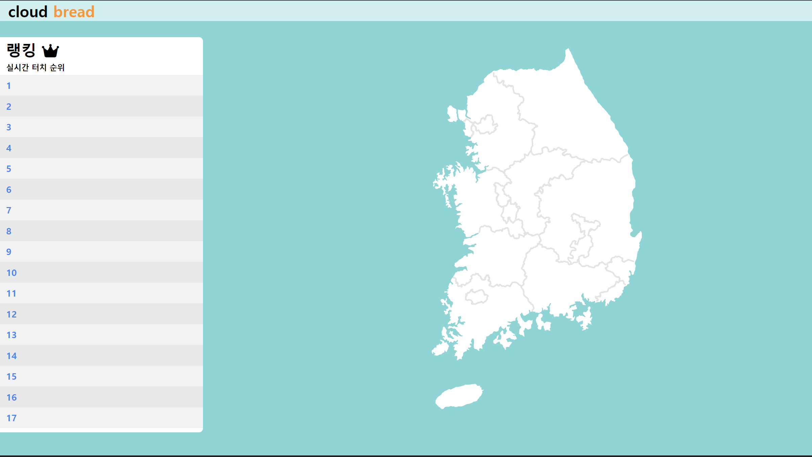
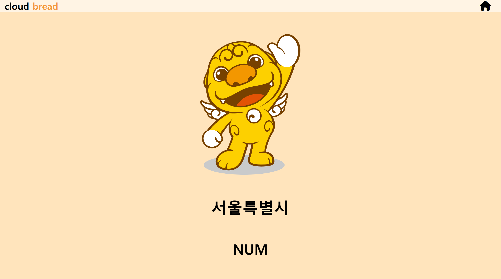

# CloudBread
2학년 2학기 Capstone(캡스톤)  
  
## 구현 형태
* 공공의 이익을 위해 지역 홍보 서비스
* 로드밸런싱을 활용한 고 과용성 서비스
* 서버 장애 시 빠른 대처를 위한 모니터링 구축
* 설명이 불 필요한 UI

## 설명
* 메인 화면에서 지도와 순위를 볼 수 있습니다.
* 지도를 누르면 각지역의 마스코트가 나오고 마스코트를 누르면 점수가 올라 갑니다.
  
개발스택
------------
  

web Design
--------------

  

server diagram
----------------
  
